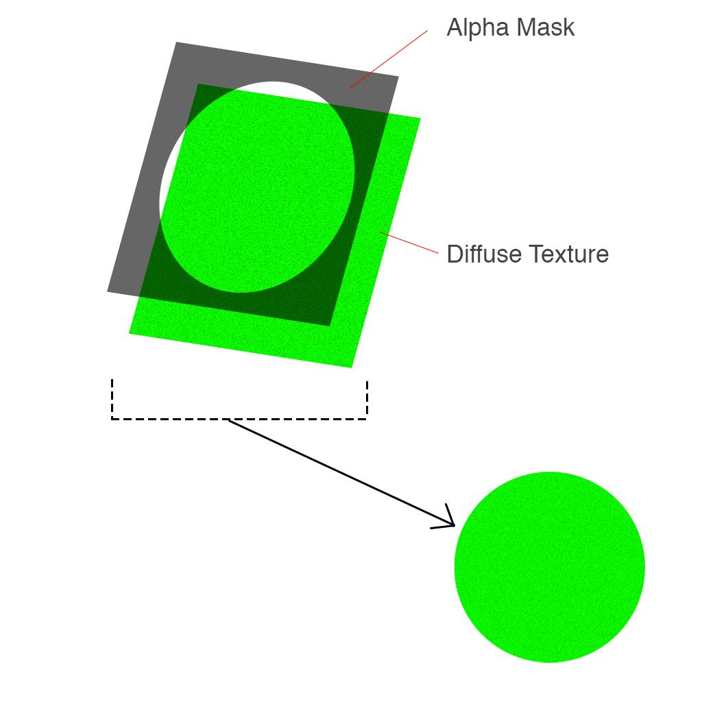
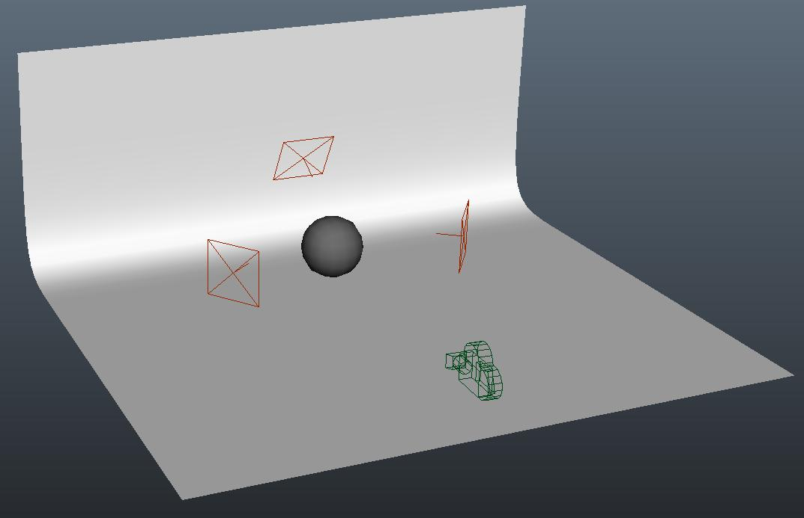
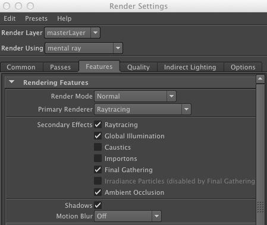
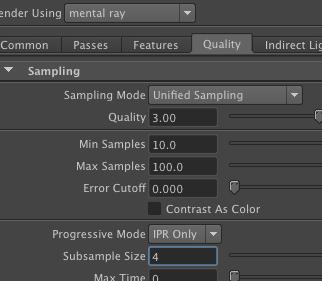
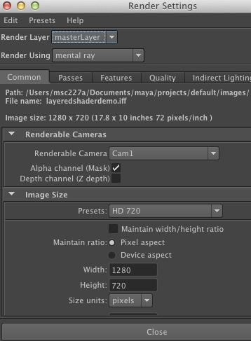

**Exercise Details**

In this exercise, you will practice creating transparency masks and layered textures.

* * *

**Learning Resources**

**Tutorials:**

**  Level 1 and 2: Novice and Intermediate**

Digital Tutors via Youtube:** **[Creating a Layered Texture](http://www.youtube.com/watch?v=Nv_hCGEC7q8)

    **Level 3: Experienced Students**

**  **Digital Tutors:** **[Subsurface Scattering](http://www.digitaltutors.com/lesson/4031)

    Vimeo: [Creating a subsurface texture with a mia_material](http://www.google.com/url?q=https%3A%2F%2Fvimeo.com%2F21581543&sa=D&sntz=1&usg=AFQjCNHrLZk_D3vaboq47FiEruNEgFOAMA)

Vimeo: [Creating layered mia-materials](https://vimeo.com/23032246)

* * *

**Steps to Completion**

**Choose a single level to complete based on your level of experience with 3D tools. If you are a novice, choose Level 1. If you have some experience, choose Level 2. If you are very experienced with 3D tools, choose Level 3.**

**Level 1 and 2:**

1) Watch tutorials on creating layered shaders.

2) Create a new project folder called **_ex_5_yourstudentID_L1_2_***.*

3) Set your project folder by choosing **File** → **Set Project**.

4) Create your folder structure by choosing **File** → **Project Window → ****_Accept_**.

5) Create a high res polygon mesh model of a cup (any kind)  [as if you created it on a pottery wheel](https://www.youtube.com/watch?v=WffFZB7blFE).

6) Create a bent ground plane.

7) Create a new perspective camera called *Cam1. *Adjust the film gate in the camera’s attributes to your desired settings.

8) Add three area lights to the scene to create a [3-point lighting set-up](http://m5designstudio.com/2011/maya-3d-tutorials/studio-three-point-lighting/).

**Your scene should be similar to the below screenshot:**

9) Create a UV Map, and use the UV Texture Editor to fine tune the UVs. Cylindrical mapping via **Create UVs → Cylindrical Mapping** might be a good starting point. Save the UV Snapshot (1024px by 1024px) as **_uv_ex_5_yourstudentID_L1_2.jpg_** in the *sourceimages* folder*.*

10) Using your UV Map as a guide, create a diffuse texture and a bump texture and save them within the *sourceimages* folder as: **_bump_ex_5_yourstudentID_L1_2.jpg diffuse_ex_5_yourstudentID_L1_2.jpg_**

11) Create two black and white alpha mask textures in Photoshop of a "solid graphic pattern" and “fine details,” and save them within the *sourceimages* folder as: **_mask_detail_ex_5_yourstudentID_L1_2.jpg mask_pattern_ex_5_yourstudentID_L1_2.jpg_**

12) Create three **Lambert** materials and one **layered shader**.

13) Add your materials to the Layered Shader in the following order:

**Layered Shader:**

**Lambert 1: (leftmost material)**

Color: Any Color

Transparency Channel - Dirt Mask

**Lambert 2: (middle position)**

Color: Any Color

Transparency Channel: Pattern Mask

**Lambert 3: (rightmost material)**

Color: Diffuse Texture

Bump: Bump Texture

14) Ensure you add your Layered Shader to your polygonal object.

15) **Enable following features and settings:**

16)  Position the new perspective camera so that you have the desired composition.

17) Click render to create a **1920px by 1080px** JPG image from *Cam1* and save it as **_render_ex_5_yourstudentID_L1_2.jpg_** in your project’s images folder.

18) Save your scene as **_ex_5_yourstudentID_L1_2_** in the scenes folder.

19) Compress the project folder once you’ve completed the tutorial and rename it **_ex_5_yourstudentID_L1_2.zip._**

20) Upload the .zip file to Lore → Calendar → Exercise 5.

21) Download and unzip the file that you uploaded to ensure you’ve included everything properly. Failure to ensure that you’ve uploaded the file will result in your exercise being graded as a late submission, or a 50% reduction in your grade.

Note: If your masks are not working, use the Alpha as Luminance setting: **Mask Texture File Node → Color Balance → Alpha as Luminance**

**Level 3:**

1) Watch tutorials on creating layered shaders.

2) Create a new project folder called **_ex_5_yourstudentID_L3_***.*

3) Set your project folder by choosing **File** → **Set Project**.

4) Create your folder structure by choosing **File** → **Project Window → ****_Accept_**.

5) Create a high res polygon mesh model of a coffee mug [as if you created it on a pottery wheel](https://www.youtube.com/watch?v=WffFZB7blFE).

6) Create a bent ground plane.

7) Create a new perspective camera called *Cam1. *Adjust the film gate in the camera’s attributes to your desired settings.

8) Add three area lights to the scene to create a [3-point lighting set-up](http://m5designstudio.com/2011/maya-3d-tutorials/studio-three-point-lighting/).

**Your scene should be similar to the below screenshot:**

9) Create a UV Map, and use the UV Texture Editor to fine tune the UVs. Cylindrical mapping via **Create UVs → Cylindrical Mapping** might be a good starting point. Save the UV Snapshot (1024px by 1024px) as **_uv_ex_5_yourstudentID_L3.jpg_** in the *sourceimages* folder*.*

10) Using your UV Map as a guide, create a diffuse texture and a bump texture and save them within the *sourceimages* folder as: **_bump_ex_5_yourstudentID_L3.jpg diffuse_ex_5_yourstudentID_L3.jpg_**

11) Create two black and white alpha mask textures in Photoshop of a graphic pattern and dirt, and save them within the *sourceimages* folder as: **_mask_dirt_ex_5_yourstudentID_L3.jpg mask_pattern_ex_5_yourstudentID_L3.jpg_**

12) Create three **mia_material_x** materials, three **surface shaders,** and one **layered shader**.

13) Add your materials to the Layered Shader in the following order:

**Layered Shader:**

**surface shader 1: (leftmost material)**

**mia_material_x 1:**

Color: Any Color

Transparency Channel - Dirt Mask

**surface shader 2: (middle position)**

**mia_material_x 2:**

Color: Any Color

Transparency Channel: Pattern Mask

**surface shader 3: (rightmost material)**

**mia_material_x 3:**

Color: Diffuse Texture

Bump: Bump Texture

14) Enable Ambient Occlusion on each mia_material_x in Material Attributes.

15) Ensure you add your Layered Shader to your polygonal object.

16) **Enable following features and settings:**

17)  Position the new perspective camera so that you have the desired composition.

18) Click render to create a 1280px by 720px JPG image from *Cam1* and save it as **_render_ex_5_yourstudentID_L3.jpg_** in your project’s images folder.

19) Save your scene as **_ex_5_yourstudentID_L3_** in the scenes folder.

20) Compress the project folder once you’ve completed the tutorial and rename it **_ex_5_yourstudentID_L3.zip._**

21) Upload the .zip file to Lore → Calendar → Exercise 5.

22) Download and unzip the file that you uploaded to ensure you’ve included everything properly. Failure to ensure that you’ve uploaded the file will result in your exercise being graded as a late submission, or a 50% reduction in your grade.

* * *

**Grading**

**  **

Your grade will be assessed according to the [Exercise Grading Criteria](https://docs.google.com/document/d/16KERm1NWgcl8CH-fPwGSSW0RJYlXDCOCwVM8WrRVuKw/edit?usp=sharing).

