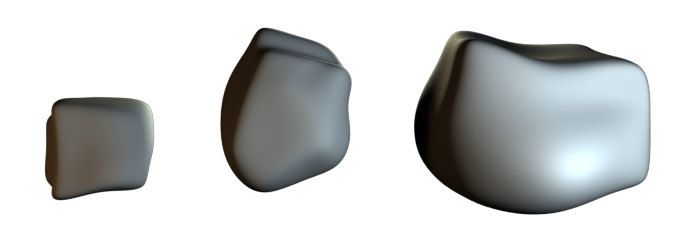
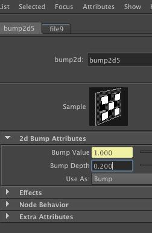
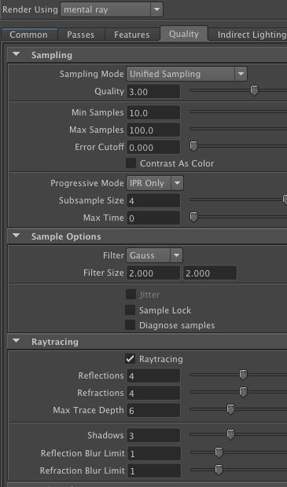
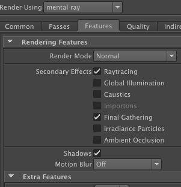
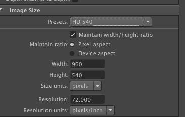
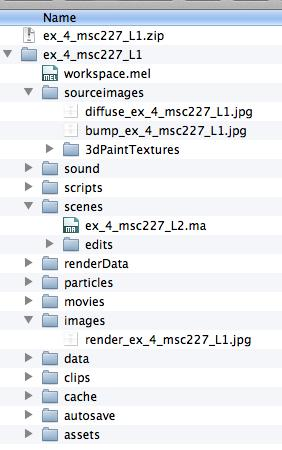
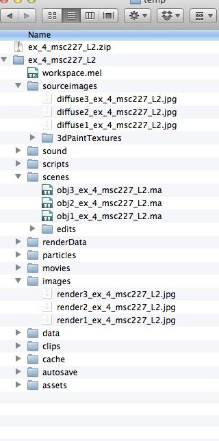

**Exercise Details**

In this exercise, you will practice uv mapping, lighting, and rendering. There are different tutorials and exercise submission requirements for three experience levels. Choose the experience level that matches your own.

* * *

**Learning Resources**

**Tutorials:**

**  Level 1: Novice Students**

[Lynda.com - Lights and Rendering](http://www.google.com/url?q=http%3A%2F%2Fwww.lynda.com%2FMaya-tutorials%2FMaya-Essentials-6-Lights-Rendering%2F96718-2.html&sa=D&sntz=1&usg=AFQjCNGIf8249pCxjO0ckMDvpFCMXeM29w)

[Digital Tutors: Building a Backdrop](http://www.digitaltutors.com/lesson/5996-Building-a-backdrop-for-studio-lighting)

**  Level 2: Intermediate Students**

**  **[Lynda Tutorials - Creating Textures and Shaders](http://www.lynda.com/Maya-2011-tutorials/creating-textures-and-shaders/62904-2.html)

**  **[Lynda Tutorials - Lighting and Rendering in Mental Ray](http://www.lynda.com/Maya-2011-tutorials/lighting-and-rendering-in-mental-ray/61222-2.html)

[Digital Tutors: Building a Backdrop](http://www.digitaltutors.com/lesson/5996-Building-a-backdrop-for-studio-lighting)

    **Level 3: Experienced Students**

    [Lynda.com - ZBrush Essential Training](http://www.lynda.com/ZBrush-4-tutorials/Essential-Training/76980-2.html)

[Lynda.com - ZBrush Character](http://www.lynda.com/3D-Animation-Character-Design-tutorials/Digital-Creature-Creation-in-ZBrush-Photoshop-and-Maya/83781-2.html)        

**Website References**

Chair History:** **[Random History](http://www.randomhistory.com/2008/11/11_chair.html)

3 Point Lighting: [5M Design Studio](http://m5designstudio.com/2011/maya-3d-tutorials/studio-three-point-lighting/)

**More Information:**

Textbook: Introducing Autodesk Maya 2015

Chapter 10 and 11

Textbook: Mastering Autodesk Maya 2015

Chapter 9 and 10

* * *

**Steps to Completion**

**Choose a single level to complete based on your level of experience with 3D tools. If you are a novice, choose Level 1. If you have some experience, choose Level 2. If you are very experienced with 3D tools, choose Level 3.**

**Level 1:**

1) Watch tutorials from Lynda on texturing and lighting.

2) Create and set a project folder called **_ex_4_yourstudentID_L1_***.*

3) Set your project folder by choosing **File** → **Set Project**.

4) Create your folder structure by choosing **File** → **Project Window → ****_Accept_**.

5) After reading [this webpage](http://www.randomhistory.com/2008/11/11_chair.html), create a new scene and create a hi-res polygon model of a **chair** from one of the mentioned time periods approximately within 4 units wide, high, and deep as well as a patch of ground 10 units wide by 10 units deep by roughly 1 unit high. These can be a single polygonal mesh or modeled as separate objects.

6) Create a new perspective called **_cam1_**. In the camera attributes, change the film gate to **35mm Academy**.

7) In your Cam1 viewport, enable the Resolution Gate: **View** → **Camera** **Settings** → **Resolution** **Gate.**

8) Create a standard 3-point lighting setup with three **_area lights_** and name them **_KeyLight_**, **_FillLight_**, and **_RimLight_**. Read More about [three point lighting](http://m5designstudio.com/2011/maya-3d-tutorials/studio-three-point-lighting/).

9) Unfold your UVs using the UV Texture editor other UV tools.

10) Apply a texture that you’ve created or found online and name it **_diffuse_ex_4_yourstudentID_L1.jpg_** in the *sourceimages* folder.

11) Create and apply a bump map to your Lambert called **_bump_ex_4_yourstudentID_L1.jpg _**in the *sourceimages* folder*.*

12) Adjust the Bump Depth to **0.200**  bump2d node connected to your bump map channel.

11) Enable Mental Ray as the rendering engine in the render settings.

12) Match the following render settings:

Render using **Mental Ray**

**Quality Tab**

1. Quality: 3

2. Min Sample: 10

3. Max Samples: 100

**Features Tab**

1. Shadows: Checked

2. Raytracing: Checked

3. Final Gathering: Checked

**Common Tab**

1. Presets: HD 540

2. Maintain Width and Height Ratio: Checked

13)  Position **_Cam1_** so that the object is in the center, filling most of the composition.

14) Render a 960px by 540px JPG image from **_Cam1_** and save it as **_render_ex_4_yourstudentID_L1.jpg_** in the images folder.

15) Save your scene as **_ex_4_yourstudentID_L1_** in the scenes folder.

16) Compress the project folder once you’ve completed the exercise and rename it **_ex_4_yourstudentID_L1.zip._**

17) Upload the .zip file to Lore → Calendar → Exercise 4.

18) Download and unzip the file that you uploaded to ensure you’ve included everything properly. Failure to ensure that you’ve uploaded the file will result in your exercise being graded as a late submission, or a 50% reduction in your grade.

**Example Folder Structure**

**Level 2:**

1) Watch the Lynda tutorials on lighting and rendering.

2) Duplicate your project folder from Exercise 3 and rename it to **_ex_4_yourstudentID_L2_***.*

3) Save each of the three scenes in the scenes folder as:

**_obj1_ex_4_yourstudentID_L2_**

**_obj2_ex_4_yourstudentID_L2_**

**_obj3_ex_4_yourstudentID_L2_**

4) Ensure all of your objects are using a mia_material_x material with your textures. ([introducing the mia_material](http://www.lynda.com/Maya-2011-tutorials/creating-textures-and-shaders/62904-2.html))

5) Compose your objects in their respective scenes

6) Create a new perspective called **_cam1_**. In the camera attributes, change the film gate to **35mm Academy**.

7) In your Cam1 viewport, enable the Resolution Gate: **View** → **Camera** **Settings** → **Resolution** **Gate.**

8) Create a standard 3-point lighting setup with three **_area lights_** and name them **_KeyLight_**, **_FillLight_**, and **_RimLight_**. Read More about [three point lighting](http://m5designstudio.com/2011/maya-3d-tutorials/studio-three-point-lighting/).

9) Create a backdrop for your models [Tutorial](http://www.digitaltutors.com/lesson/5996-Building-a-backdrop-for-studio-lighting) (You may use the same one in each scene by exporting the backdrop as an FBX). 

10) In the material attributes for each material, enable ambient occlusion.

11) Save your diffuse textures in the sourceimages folder as:

**_diffuse1_ex_4_yourstudentID_L2.jpg_**

**_diffuse2_ex_4_yourstudentID_L2.jpg_**

**_diffuse3_ex_4_yourstudentID_L2.jpg_**

12) Enable the following render settings:

**Features Tab:**

1. Raytracing

2. Global Illumination

3. Final Gathering

13)  Position **_Cam1_** so that the object is in the center, filling most of the composition.

14) Render your three scenes 960px by 540px as a JPG image from **_Cam1_** and save them in the images folder as:

**_render1_ex_4_yourstudentID_L2.jpg_**

**_render2_ex_4_yourstudentID_L2.jpg_**

**_render3_ex_4_yourstudentID_L2.jpg_**

15) Compress the project folder once you’ve completed the tutorial and rename it **_ex_4_yourstudentID_L2.zip._**

16) Upload the .zip file to Lore → Calendar → Exercise 4.

17) Download and unzip the file that you uploaded to ensure you’ve included everything properly. Failure to ensure that you’ve uploaded the file will result in your exercise being graded as a late submission, or a 50% reduction in your grade.

**Example Folder Structure**

**Level 3:**

1) Watch the Essential Training and Digital Character Creation tutorials from Lynda on modeling with ZBrush through to the end.

2) Using the techniques learned in the Digital Creature Creation tutorials, continue working on your model.

3) Complete the your image to the level of finish of the tutorial’s final result. Instead of rendering an animated turntable, just render a single jpg image and name it **_render_ex_4_yourstudentID_L3.jpg_**.

4) Include your zbrush work file in the .zip file with the project folder.

5) Compress the project folder and rename it **_ex_4_yourstudentID_L3.zip._**

6) Upload the .zip file to Lore → Calendar → Exercise 4.

* * *

**Grading**

**  **

Your grade will be assessed according to the [Exercise Grading Criteria](https://docs.google.com/document/d/16KERm1NWgcl8CH-fPwGSSW0RJYlXDCOCwVM8WrRVuKw/edit?usp=sharing).

