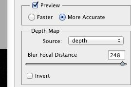
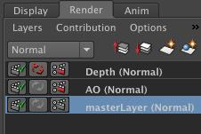
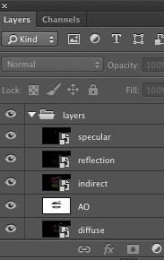
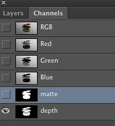

**Exercise Details**

In this exercise, you will produce render passes and composite your renders together in Photoshop to create the final image.

* * *

**Learning Resources**

**Tutorials:**

**Level 1 and 2: Novice, Intermediate**

Render Passes

    Digital Tutors: [Multi-passes for Maya](http://www.digitaltutors.com/tutorial/1830-Multi-pass-Rendering-Techniques-in-Maya)

    Digital Tutors: [Luminance Depth](http://www.digitaltutors.com/11/training.php?vid=10044&autoplay=1)

Digital Tutors: [Creating an Ambient Occlusion Render Pass](http://www.digitaltutors.com/11/training.php?vid=13589&autoplay=1)

    

Optional Compositing

Digital Tutors: [Compositing in After Effects](http://www.digitaltutors.com/11/training.php?vid=13593)

Shader Information:

            Autodesk: [The mia_material](http://download.autodesk.com/us/maya/2009help/mr/shaders/architectural/arch_mtl.html)

    

        Alpha Channels:

            lynda.psu.edu: [Alpha Channels](http://www.lynda.com/Photoshop-tutorials/Photoshop-Masking-Compositing-Fundamentals/86002-2.html?srchtrk=index%3a4%0alinktypeid%3a2%0aq%3aphotoshop+alpha+channel%0apage%3a1%0as%3arelevance%0asa%3atrue%0aproducttypeid%3a2) (Section 2)

**Level 3: Advanced**

Image Based Lighting: 

    Digital Tutors: [Image Based Lighting](http://www.digitaltutors.com/lesson/29618)

Image Sequence Render Passes in AfterEffects: 

Youtube: [http://youtu.be/RJoSIySo4tw](http://youtu.be/RJoSIySo4tw)

**Documentation:**

[Autodesk White Paper](http://images.autodesk.com/adsk/files/maya_render_pass_concepts_and_techniques_whitepaper_us.pdf)

* * *

**Steps to Completion**

**Choose a single level to complete based on your level of experience with 3D tools. If you are a novice, choose Level 1. If you have some experience, choose Level 2. If you are very experienced with 3D tools, choose Level 3.**

**Level 1:**

1) Watch tutorials on creating render passes.

2) Create a new project folder, called **_ex_6_yourstudentID_L1,_** set your scene to the project folder, and create the sub folders by choosing **_File_** → **_Project Window_*** → ***_Accept_***.*

3) Create a sculpture using only primitive shapes. You can rotate, translate, scale, and smooth the primitives with the Smooth tool (Not the smooth preview), but you cannot adjust individual vertices. The shapes should have a mia_material_x_passes material assigned. You may assign different versions of this material to different shapes, adjusting the attributes of the materials to your liking. Focus on creating interesting composition and contrast.

4) Create lighting using at least two area lights, or image based lighting.

5) Enable following features and settings:

a) Ambient Occlusion (Found in the material attributes and the render settings)

b) Shadows (Enable in area light attributes under raytracing)

c) Reflections (Enable in Mental Ray render settings)

d) Global Illumination (Enable in Mental Ray render settings)

e) Final Gathering (Enable in Mental Ray render settings)

f) Unified Sampling Quality: 1.5 (Mental Ray render settings)

6) In the Render Settings, under the common tab, change the image size to width of 1920px and a height of 1080px.

7) Create a new Render Layer in the Layer Editor. To do this, open the outliner and select your meshes by Command clicking to select multiple objects. Once your meshes are selected, open the Channel Box/Layer Editor and click on Layers → Create Layer from Selected. Then, click on Layer → Attributes. In the attributes, click on presets and choose Luminance Depth. You must dial in the settings to match your scene, or it will not render properly. Please see [this tutorial](http://www.digitaltutors.com/11/training.php?vid=10044&autoplay=1) for more detail. Repeat this process to create a Render Layer for Ambient Occlusion by choosing the Ambient Occlusion preset in the Render Layer attributes. Or, set it up manually by following [this tutorial](http://www.digitaltutors.com/11/training.php?vid=13589&autoplay=1). Again, tweak settings to your scene.

8) Click on the MasterLayer. Open the Render Settings and click on the Passes tab. **Create the following passes:**

            - Diffuse

- Indirect

- Reflection

- Specular

9) Highlight the passes and click on the link icon to associate them with the render layer. They will move to the box below.

10) Image format: PNG. In Render Settings, go to the common tab → File Output. Type the following into the File Name Prefix box: **_<RenderLayer>/<RenderPass>_**

11) Choose Rendering from the drop down tab at the top left of the interface. In the menu at the top, choose Render → Batch Render.

12) Create a new Photoshop document that is the size of your renders. Create the following layers with their respective blending mode:

            **Layers:**

- Specular / Screen

- Reflection / Screen

- Indirect / Screen

- Ambient Occlusion / Multiply

- Diffuse / Normal

**Channels:**

- Luminance Depth / Normal (Copy this layer and paste into [a new alpha channel](http://www.lynda.com/Photoshop-tutorials/Photoshop-Masking-Compositing-Fundamentals/86002-2.html?srchtrk=index%3a4%0alinktypeid%3a2%0aq%3aphotoshop+alpha+channel%0apage%3a1%0as%3arelevance%0asa%3atrue%0aproducttypeid%3a2))

13) Create a new layer that is all of the other layers merged together. Choose Filter → Blur → Lens Blur. Choose the new alpha channel you created from the source dropdown. Adjust the settings as necessary.

**Source: ****_depth_**

14) Consider color grading options. Here is some [inspiration](http://sixrevisions.com/photoshop/22-professional-photoshop-image-enhancing-tutorials/).

15) Save the PSD file **WITH ABOVE LAYERS** as **_ex_6_yourstudentID_L1.psd._**

16) Compress **ONLY** the PSD file once you’ve completed the tutorial and rename it **_ex_6_yourstudentID_L1.zip._**

17) Upload the .zip file to Lore → Calendar → Exercise 6.

18) Download and unzip the file that you uploaded to ensure you’ve included everything properly. Failure to ensure that you’ve uploaded the file will result in your exercise being graded as a late submission, or a 50% reduction in your grade.

**Level 2:**

1) Watch tutorials on creating render passes.

2) Create a new project folder, called **_ex_6_yourstudentID_L2,_** set your scene to the project folder, and create the sub folders by choosing **_File_** → **_Project Window_*** → ***_Accept_***.*

3) Continue using your shapes from previous exercises. The shapes should have a mia_material_x_passes material assigned. You may assign different versions of this material to different shapes, adjusting the attributes of the materials to your liking. Focus on creating interesting composition and contrast.

4) Create lighting using the 3-point lighting setup with a backdrop.

5) Enable following features and settings:

a) Ambient Occlusion (Found in the material attributes and the render settings)

b) Shadows (Enable in area light attributes under raytracing)

c) Reflections (Enable in Mental Ray render settings)

d) Global Illumination (Enable in Mental Ray render settings)

e) Final Gathering (Enable in Mental Ray render settings)

f) Unified Sampling Quality: 1.5 (Mental Ray render settings)

6) In the Render Settings, under the common tab, change the image size to width of 640 and a height of 360.

7) Create a new Render Layer in the Layer Editor. To do this, open the outliner and select your meshes by Command clicking to select multiple objects. Once your meshes are selected, open the Channel Box/Layer Editor and click on Layers → Create Layer from Selected. Then, click on Layer → Attributes. In the attributes, click on presets and choose Luminance Depth. You must dial in the settings to match your scene, or it will not render properly. Please see [this tutorial](http://www.digitaltutors.com/11/training.php?vid=10044&autoplay=1) for more detail. Repeat this process to create a Render Layer for Ambient Occlusion by choosing the Ambient Occlusion preset in the Render Layer attributes. Or, set it up manually by following [this tutorial](http://www.digitaltutors.com/11/training.php?vid=13589&autoplay=1). Again, tweak settings to your scene.

8) Click on the MasterLayer. Open the Render Settings and click on the Passes tab. **Create the following passes:**

            - Diffuse

- Indirect

- Reflection

- Specular

- Refraction (Formerly caustics, only if you are rendering glass)

9) Highlight the passes and click on the link icon to associate them with the render layer. They will move to the box below.

10) In Render Settings, go to the common tab → File Output. Type the following into the File Name Prefix box: **_<RenderLayer>/<RenderPass>_**

11) Choose Rendering from the drop down tab at the top left of the interface. In the menu at the top, choose Render → Batch Render.

12) Create a new Photoshop document that is the size of your renders. Create the following layers with their respective blending mode:

            **Layers:**

- Specular / Screen

- Reflection / Screen

- Indirect / Screen

- Ambient Occlusion / Multiply

- Diffuse / Normal

**Channels:**

- Luminance Depth / Normal (Copy this layer and paste into [a new alpha channel](http://www.lynda.com/Photoshop-tutorials/Photoshop-Masking-Compositing-Fundamentals/86002-2.html?srchtrk=index%3a4%0alinktypeid%3a2%0aq%3aphotoshop+alpha+channel%0apage%3a1%0as%3arelevance%0asa%3atrue%0aproducttypeid%3a2))

  

13) Create a new layer that is all of the other layers merged together. Choose Filter → Blur → Lens Blur. Choose the new alpha channel you created from the source dropdown. Adjust the blur settings as desired.

**Source: ****_depth_**

14) Consider color grading options. Here is some [inspiration](http://sixrevisions.com/photoshop/22-professional-photoshop-image-enhancing-tutorials/).

15) Save the PSD file **WITH ABOVE LAYERS **as **_ex_6_yourstudentID_L2_****.psd.** inside the images folder.

16) Compress **ONLY** the PSD file once you’ve completed the tutorial and rename it **_ex_6_yourstudentID_L2.zip._**

17) Upload the .zip file to Lore → Calendar → Exercise 6.

18) Download and unzip the file that you uploaded to ensure you’ve included everything properly. Failure to ensure that you’ve uploaded the file will result in your exercise being graded as a late submission, or a 50% reduction in your grade.

**Level 3:**

1) Watch tutorials on creating render passes.

2) Create a new project folder, called **_ex_6_yourstudentID_L3,_** and set your scene to the project folder, and create the sub folders by choosing *File* → *Project Window → Accept.*

3) Continue working on your Teddy Bear from previous lessons. Focus on creating interesting composition and contrast.

4) Create lighting using image based lighting with at least one area light.

5) Enable following features and settings:

a) Ambient Occlusion (Found in the spotlight attributes and the render settings)

b) Shadows (Enable in area light attributes under raytracing)

c) Reflections (Enable in Mental Ray render settings)

d) Global Illumination (Enable in Mental Ray render settings)

e) Final Gathering (Enable in Mental Ray render settings)

f) Unified Sampling Quality: 1.5 (Mental Ray render settings)

g) Uncheck Default Light (Render Settings → Common → Render Options)

6) In the Render Settings, under the common tab, change the image size to width of 640 and a height of 360.

7) Create a new Render Layer in the Layer Editor. To do this, open the outliner and select your meshes by Command clicking to select multiple objects. Once your meshes are selected, open the Channel Box/Layer Editor and click on Layers → Create Layer from Selected. Then, click on Layer → Attributes. In the attributes, click on presets and choose Luminance Depth. You must dial in the settings to match your scene, or it will not render properly. Please see [this tutorial](http://www.digitaltutors.com/11/training.php?vid=10044&autoplay=1) for more detail. Repeat this process to create a Render Layer for Ambient Occlusion by choosing the Ambient Occlusion preset in the Render Layer attributes. Or, set it up manually by following [this tutorial](http://www.digitaltutors.com/11/training.php?vid=13589&autoplay=1). Again, tweak settings to your scene.

8) Click on the MasterLayer. Open the Render Settings and click on the Passes tab. **Create the following passes:**

            - Specular / Screen

- Reflection / Screen

- Indirect / Screen

- Ambient Occlusion / Multiply

- Diffuse / Normal

- Luminance Depth / Normal (Copy this layer and paste into [a new alpha channel](http://www.lynda.com/Photoshop-tutorials/Photoshop-Masking-Compositing-Fundamentals/86002-2.html?srchtrk=index%3a4%0alinktypeid%3a2%0aq%3aphotoshop+alpha+channel%0apage%3a1%0as%3arelevance%0asa%3atrue%0aproducttypeid%3a2))

9) Highlight the passes and click on the link icon to associate them with the render layer. They will move to the box below.

10) In Render Settings, go to the common tab → File Output. Type the following into the File Name Prefix box: **_<RenderLayer>/<RenderPass>_**

11) Choose Rendering from the drop down tab at the top left of the interface. In the menu at the top, choose Render → Batch Render.

12) Create a new Photoshop document that is the size of your renders. Create the following layers with their respective blending mode:

            

**Layers:**

- Specular / Screen

- Reflection / Screen

- Indirect / Screen

- Ambient Occlusion / Multiply

- Diffuse / Normal

**Channels:**

- Luminance Depth / Normal (Copy this layer and paste into a new alpha channel)

13) Create a new layer that is all of the other layers merged together. Choose Filter → Blur → Lens Blur. Choose the new alpha channel you created from the source dropdown. Adjust the settings as necessary.

**Source: ****_depth_**

14) Consider color grading options. Here is some [inspiration](http://sixrevisions.com/photoshop/22-professional-photoshop-image-enhancing-tutorials/).

15) Save the PSD file **WITH ABOVE LAYERS **as **_ex_6_yourstudentID_L3.psd._**

16) Compress **ONLY** the PSD file once you’ve completed the tutorial and rename it **_ex_6_yourstudentID_L3.zip._**

17) Upload the .zip file to Lore → Calendar → Exercise 6.

18) Download and unzip the file that you uploaded to ensure you’ve included everything properly. Failure to ensure that you’ve uploaded the file will result in your exercise being graded as a late submission, or a 50% reduction in your grade.

* * *

**Example Download:**

**[Renderpasses PSD Downloa**d](https://docs.google.com/file/d/0BzXX6rmROMNWNzZzY2ZySEg2Qlk/edit?usp=sharing)** (Note: This file has extra layers not needed for completion of the exercise)**

* * *

**Grading**

**  **

Your grade will be assessed according to the [Exercise Grading Criteria](https://docs.google.com/document/d/16KERm1NWgcl8CH-fPwGSSW0RJYlXDCOCwVM8WrRVuKw/edit?usp=sharing).

