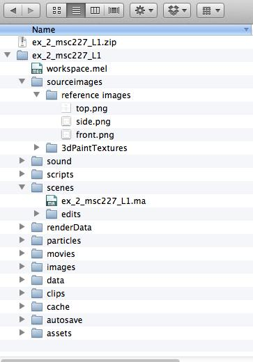
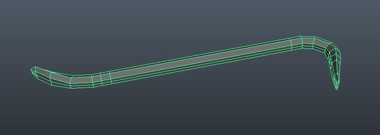
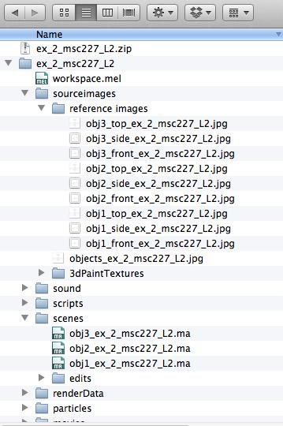
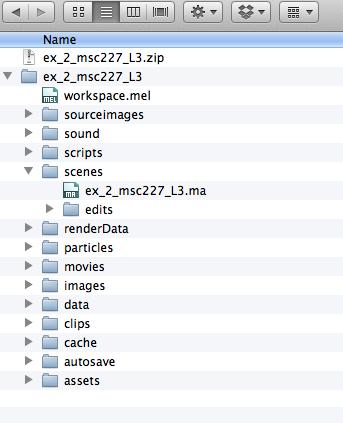

**Exercise Details**

In this exercise, you will gain basic understanding of modeling fundamentals. There are different tutorials and exercise submission requirements for the three experience levels. Choose the experience level that matches your own.

* * *

**Learning Resources**

**Tutorials:**

**Level 1: Novice Students**

[Lynda.com - Modeling with Polygons](http://www.lynda.com/Maya-tutorials/Maya-Essentials-2-Polygonal-Modeling-Techniques/96715-2.html)

        [Lynda.com - Modeling with Nurbs](http://www.lynda.com/Maya-tutorials/Maya-Essentials-3-NURBS-Modeling-Techniques/96716-2.html)

**Level 2: Intermediate Students**

[Lynda.com - Modeling with Polygons](http://www.lynda.com/Maya-tutorials/Maya-Essentials-2-Polygonal-Modeling-Techniques/96715-2.html)

        [Lynda.com - Modeling with Nurbs](http://www.lynda.com/Maya-tutorials/Maya-Essentials-3-NURBS-Modeling-Techniques/96716-2.html)

    [Tutorial - AO](https://www.youtube.com/watch?v=v3SXSffuvnk)

[Contour Rendering](https://vimeo.com/64291535)

    **Level 3: Experienced Students**

    [Lynda.com - ZBrush Essential Training](http://www.lynda.com/ZBrush-4-tutorials/Essential-Training/76980-2.html)

        (Lessons 1- 7)

[Lynda.com - ZBrush Character](http://www.lynda.com/3D-Animation-Character-Design-tutorials/Digital-Creature-Creation-in-ZBrush-Photoshop-and-Maya/83781-2.html)

        (Lessons 1 - 3)

**Reference Websites**

[Random Objects Generator](http://www.randomlists.com/things)

**More Information:**

Textbook: Introducing Autodesk Maya 2015

Chapter 4 and Chapter 5

Textbook: Mastering Autodesk Maya 2015

Chapter 3 and Chapter 4

* * *

**Steps to Completion**

**Choose a single level to complete based on your level of experience with 3D tools. If you are a novice, choose Level 1. If you have some experience, choose Level 2. If you are very experienced with 3D tools, choose Level 3.**

**Level 1:**

1) Watch tutorials from Lynda on modeling with Polygons and Nurbs.

2) Download [these project files](https://docs.google.com/file/d/0BzXX6rmROMNWandfd3hKLXRCdmM/edit) and use the scene file as the starting point and rename the project folder to : **_ex_2_yourstudentID_L1_**.

3) Set your project to the downloaded folder by choosing **File** → **Set Project**.

4) Model the airplane from the reference images to the best of your ability. The final mesh should be in polygons.

5) Save your scene as **_ex_2_yourstudentID_L1_** in the scenes folder.

6) Compress the project folder once you’ve completed the tutorial and rename it **_ex_2_yourstudentID_L1.zip._**

7) Upload the .zip file to Lore → Calendar → Exercise 2.

8) Download and unzip the file that you uploaded to ensure you’ve included everything properly. Failure to ensure that you’ve uploaded the file will result in your exercise being graded as a late submission, or a 50% reduction in your grade.

**Example Folder Structure**

**Level 2:**

1) Watch tutorials from Lynda on modeling.

2) Obtain three randomly generated objects from [this website](http://www.randomlists.com/things). Include a screenshot of the website objects in your **_sourceimages_** folder called **_objects_ex_2_yourstudentID_L2.jpg (or .png)_**

3) Save each three scenes folder.

*Naming:*

**_obj1_ex_2_yourstudentID_L2_**

**_obj2_ex_2_yourstudentID_L2_**

**_obj3_ex_2_yourstudentID_L2_**

4) Draw 3 image planes for each object and set up the image reference planes in their respective Maya scene. Ensure they are square. Place them in the **_sourceimages → referenceimages_** folder. Instructions for aligning reference images in Photoshop: [Link](http://www.webdesign.org/photoshop/photoshop-basics/cutting-up-blueprints-for-3d-modelling.4970.html)

*Naming:*

**_obj1_side_ex_2_yourstudentID_L2.jpg_**

**_obj1_front_ex_2_yourstudentID_L2.jpg_**

**_obj1_top_ex_2_yourstudentID_L2.jpg_**

**_obj2_side_ex_2_yourstudentID_L2.jpg_**

**_obj2_front_ex_2_yourstudentID_L2.jpg_**

**_obj2_top_ex_2_yourstudentID_L2.jpg_**

**_obj3_side_ex_2_yourstudentID_L2.jpg_**

**_obj3_front_ex_2_yourstudentID_L2.jpg_**

**_obj3_top_ex_2_yourstudentID_L2.jpg_**

5) Create one polygonal object for each scene file from your set of randomly generated objects in Step 2. (You should be making three objects since you’ve created three scenes.)

6) Capture the gesture of the objects with as little detail as needed to describe the shape. Do not smooth the object. Focus on maintaining quads and [organized edgeflow](http://www.digitaltutors.com/lesson/15804-Edge-Flow). **See example image of a crowbar below:**

7) Add an ambient occlusion surface shader to your model and create a backdrop: [Tutorial - AO](https://www.youtube.com/watch?v=v3SXSffuvnk)

8) Enable the contour rendering: [Tutorial - Contour Rendering](https://vimeo.com/64291535)

    **NOTE: Read description of video for Maya’s Rendering needs.**

9) Enable Mental Ray as the rendering engine in the render settings.

10) Match the following render settings:

Render using **Mental Ray**

**Quality Tab**

1. Quality: 3

2. Min Sample: 10

3. Max Samples: 100

**Features Tab**

1. Shadows: Checked

2. Raytracing: Checked

3. Final Gathering: Checked

4. Ambient Occlusion; Checked

5. Contours: Enable Contour Rendering: Checked

**Common Tab**

1. Image Format: JPEG (jpg)

2. Presets: HD 540

3. Maintain Width and Height Ratio: Checked

11) Render three images to the **_images_** folder.

*Naming:*

**_render1_ex_2_yourstudentID_L2.jpg_**

**_render2_ex_2_yourstudentID_L2.jpg_**

**_render3_ex_2_yourstudentID_L2.jpg_**

12) Compress the project folder once you’ve completed the tutorial and rename it **_ex_2_yourstudentID_L2.zip._**

13) Upload the .zip file to Lore → Calendar → Exercise 2.

14) Download and unzip the file that you uploaded to ensure you’ve included everything properly. Failure to ensure that you’ve uploaded the file will result in your exercise being graded as a late submission, or a 50% reduction in your grade.

**Example Folder Structure**

**Level 3:**

1) Watch tutorials from Lynda on modeling with ZBrush.

2) Using the techniques learned in the Digital Creature Creation tutorials, create a **Vegetable Monster**. Creatively interpret what that means.

3) Your ZBrush model should be of similar refinement to the model in Digital Creature Creation, by the end of Lesson 3.

4) Import your model into Maya. (If this proves difficult, ask for assistance) 

5) Save your scene as **_ex_2_yourstudentID_L3_** in the scenes folder.

6) Compress the project folder once you’ve completed the tutorial and rename it **_ex_2_yourstudentID_L3.zip._**

7) Upload the .zip file to Lore → Calendar → Exercise 2.

8) Download and unzip the file that you uploaded to ensure you’ve included everything properly. Failure to ensure that you’ve uploaded the file will result in your exercise being graded as a late submission, or a 50% reduction in your grade.

**Example Folder Structure**

* * *

**Grading**

**  **

Your grade will be assessed according to the [Exercise Grading Criteria](https://docs.google.com/document/d/16KERm1NWgcl8CH-fPwGSSW0RJYlXDCOCwVM8WrRVuKw/edit?usp=sharing).

