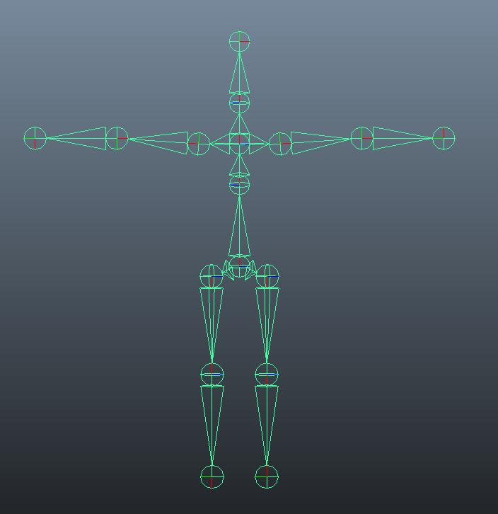

**Exercise 8 Details**

In this exercise, you will practice creating a rig for a polygon mesh and adding deformers. Level 1 students will create a simple biped rig starting with [this project file](https://docs.google.com/file/d/0BzXX6rmROMNWeVVUZUxrYkJVcms/edit). Level 2 and 3 students will create more complex polygonal biped character meshes and rigs.

* * *

**Learning Resources**

**Level 1**

Rigging

Digital Tutors: [Beginner’s Guide to Rigging](http://www.digitaltutors.com/11/training.php?pid=502)

Lynda.com: [Animation Tools](http://www.lynda.com/Maya-tutorials/Maya-Essentials-5-Animation-Tools/96719-2.html)

**Levels 2 and 3**

Rigging

Digital Tutors: [Creating a Character Rig](http://www.digitaltutors.com/11/training.php?vid=19169&autoplay=1)

Lynda.com: [Character Rigging](http://www.lynda.com/Maya-tutorials/Character-Rigging-in-Maya/92564-2.html)

**Levels 3**

Principles of Animation

Digital Tutors: [Character Rigging for Production](http://www.digitaltutors.com/11/training.php?pid=321)

Digital Tutors: [12 Principles of Animation](http://www.digitaltutors.com/11/training.php?pid=297)

**Optional Learning**

**      **Lynda Tutorials: [Animation Principles](http://www.lynda.com/Maya-tutorials/Character-Animation-Fundamentals-with-Maya/54994-2.html)

**      **

* * *

**Steps to Completion**

**Choose a single level to complete based on your level of experience with 3D tools. If you are a novice, choose Level 1. If you have some experience, choose Level 2. If you are very experienced with 3D tools, choose Level 3.**

**Level 1:**

1) Watch the level 1 rigging tutorials from Digital Tutors.

2) Download the base Maya [rigging project folder](https://docs.google.com/file/d/0BzXX6rmROMNWeVVUZUxrYkJVcms/edit).

3) Save a new scene called **_ex_8_yourstudentID_L1.mb_**, set your scene to the project folder, and create the sub folders by choosing **_File_** → **_Project Window_*** → ***_Accept_***.*

4) Add more geometry (edge loops) to the polygon mesh so that you are able to minimize unwanted distortion that results from moving a joints bound to improperly created geometry. Add geometry to articulate the knee, elbows, and arms.

5) Create joints for the torso, hips, knees, legs, feet, shoulders, arms, neck, and head. Name and number them for your reference. See image below:

6) Smooth bind the joints to the polygonal mesh by selecting both the mesh and the joints, and then choosing, *Skin* → *Bind*. Click on ‘Smooth Bind.’

7) Use the Component Editor and Paint Skin Weights tool to make adjustments to joint influences.

8) Pose the biped to be in natural sitting pose.

9) Compress the project folder once you’ve completed the tutorial and rename it **_ex_8_yourstudentID_L1.zip._**

10) Upload the .zip file to Lore → Calendar → Exercise 8.

11) Download and unzip the file that you uploaded to ensure you’ve included everything properly. Failure to ensure that you’ve uploaded the file will result in your exercise being graded as a late submission, or a 50% reduction in your grade.

**Level 2:**

1) Watch the level 2 rigging tutorials from Lynda and Digital Tutors.

2) Create a new project folder called **_ex_8_yourstudentID_L2_**, set your scene to the project folder, and create the sub folders by choosing **_File_** → **_Project Window_*** → ***_Accept_***.*

3) Build a simple biped character mesh.

4) Create joints, IKs, and controls for the head, arms, and legs.

5) Bind your rig to your mesh.

6) Keyframe your character’s movement, showing the versatility of your rig over 120 frames.

7) Save the scene file in your scenes folder as **_ex_8_yourstudentID_L2_**.

8) Compress the project folder once you’ve completed the tutorial and rename it **_ex_8_yourstudentID_L2.zip._**

9) Upload the .zip file to Lore → Calendar → Exercise 8.

10) Download and unzip the file that you uploaded to ensure you’ve included everything properly. Failure to ensure that you’ve uploaded the file will result in your exercise being graded as a late submission, or a 50% reduction in your grade.

**Level 3:**

1) Watch the animation tutorials from Lynda and Digital Tutors.

2) Create a new project folder called **_ex_8_yourstudentID_L3_**, set your scene to the project folder, and create the sub folders by choosing **_File_** → **_Project Window_*** → ***_Accept_***.*

3) Create a fully rigged character including a center of gravity control, limb and body part controls, rotation constraints, and set-driven keys.

4) Create a 10 second 240 frame animation expressing one of the 12 animation principles.

5) Save the scene file in your scenes folder as **_ex_8_yourstudentID_L3_**.

6) Compress the project folder once you’ve completed the tutorial and rename it **_ex_8_yourstudentID_L3.zip._**

7) Upload the .zip file to Lore → Calendar → Exercise 8.

8) Download and unzip the file that you uploaded to ensure you’ve included everything properly. Failure to ensure that you’ve uploaded the file will result in your exercise being graded as a late submission, or a 50% reduction in your grade.

* * *

**Grading**

**  **

Your grade will be assessed according to the [Exercise Grading Criteria](https://docs.google.com/document/d/16KERm1NWgcl8CH-fPwGSSW0RJYlXDCOCwVM8WrRVuKw/edit?usp=sharing). 

