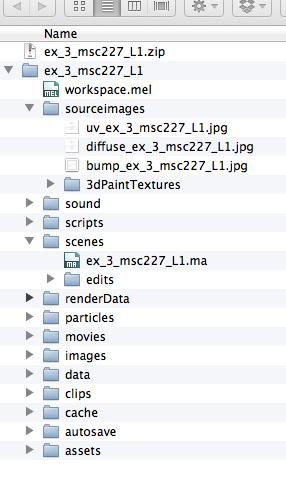
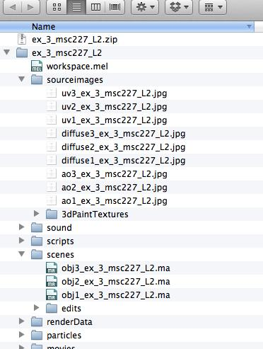
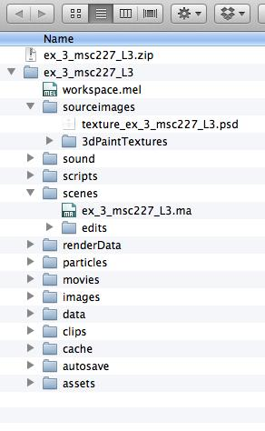

**COURSE:** ART 314: 3D MODELING, RENDERING, AND ANIMATION

**INSTRUCTOR:** MICHAEL COLLINS

**Exercise 3 Details**

    

In this exercise, you will practice UV mapping and applying textures to surface shaders. There are different tutorials and exercise submission requirements for three experience levels. Choose the experience level that matches your own.

* * *

**Learning Resources**

**Tutorials:**

**  Level 1: Novice Students**

[Lynda.com - Textures and Materials](http://www.lynda.com/Maya-tutorials/Maya-Essentials-4-Creating-Textures-Materials/96717-2.html)

**  Level 2: Intermediate Students**

**  **[Digital Tutors - UV Mapping](http://www.digitaltutors.com/11/training.php?vid=9346&autoplay=1)

[Digital Tutors - AO Texture Baking](http://www.digitaltutors.com/11/training.php?vid=9348&autoplay=1)

[Tutorial - AO](https://www.youtube.com/watch?v=v3SXSffuvnk)

[Digital Tutors - Diffuse texture workflow](http://www.digitaltutors.com/11/training.php?vid=9350&autoplay=1)

    **Level 3: Experienced Students**

    [Lynda.com - ZBrush Essential Training](http://www.lynda.com/ZBrush-4-tutorials/Essential-Training/76980-2.html)

        (Lessons 7 - 10)

[Lynda.com - ZBrush Character](http://www.lynda.com/3D-Animation-Character-Design-tutorials/Digital-Creature-Creation-in-ZBrush-Photoshop-and-Maya/83781-2.html)

        (Lessons 6 - 9)

**More Information:**

Textbook: Introducing Autodesk Maya 2015

Chapter 7

Textbook: Mastering Autodesk Maya 2015

Chapter 11

* * *

**Steps to Completion**

**Choose a single level to complete based on your level of experience with 3D tools. If you are a novice, choose Level 1. If you have some experience, choose Level 2. If you are very experienced with 3D tools, choose Level 3.**

**Level 1:**

1) Watch tutorials from Lynda on modeling with Polygons and Nurbs.

2) Create a new project folder called **_ex_3_yourstudentID_L1_***.*

3) Set your project to the downloaded folder by choosing **File** → **Set Project**.

4) Create your folder structure by choosing **File** → **Project Window → ****_Accept_**.

5) Build a spaceship using no more than 150 tris. (Example: [Kenneth Fejer](http://www.kennethfejer.com/lowpoly.html))

6) Go to **Create UVs** and choose an appropriate mapping tool.

7) Organize your UV layout with the **UV Texture Editor **tool.

8) Export your UV layout from the **UV Texture Editor → Polygons → ****UV Snapshot** with a resolution of 1024px by 1024px to the *sourceimages* folder as **_uv_ex_3_yourstudentID_L1.jpg_**.

9) Open the UV layout image into Photoshop. Paint a *diffuse* texture using the UV snapshot as a guide.

10) Save your diffuse texture as **_diffuse_ex_3_yourstudentID_L1.jpg_** in the *sourceimages* folder.

11) Use Photoshop to create a grayscale bump map texture (1024px by 1024px) using the diffuse texture and UV snapshot as a guide.

12) Save your bump map texture as **_bump_ex_3_yourstudentID_L1.jpg_** in the *sourceimages* folder.

13) Apply your diffuse and bump textures to your model’s Lambert shader on the Color (diffuse) and Bump Mapping channels respectively. If you can’t see your textures, ensure that the viewport’s **View → Hardware Texturing** feature is enabled. Click on render to check that the bump map is functioning properly.

14) Save your scene as **_ex_3_yourstudentID_L1_** in the scenes folder.

15) Compress the project folder once you’ve completed the tutorial and rename it **_ex_3_yourstudentID_L1.zip._**

16) Upload the .zip file to Lore → Calendar → Exercise 3.

17) Download and unzip the file that you uploaded to ensure you’ve included everything properly. Failure to ensure that you’ve uploaded the file will result in your exercise being graded as a late submission, or a 50% reduction in your grade.

**Example Folder Structure**

**Level 2:**

1) Duplicate your project folder from Exercise 2 and rename it to **_ex_3_yourstudentID_L2_**.

2) For each of the three objects you modeled in the last exercise:

a) Unwrap the object’s UVs

b) Export a UV snapshot

d) Bake an Ambient Occlusion (AO) texture *(*[Tutorial - AO](https://www.youtube.com/watch?v=v3SXSffuvnk)*, *[Digital Tutors - AO Texture Baking](http://www.digitaltutors.com/11/training.php?vid=9348&autoplay=1)*)*

c) Create a diffuse texture in Photoshop, (1024px by 1024px) and incorporate the AO shadow information into the texture.

Note: Follow the Level 2 learning resources for more specific details.

3) Save each of the three scenes in the scenes folder as:

**_obj1_ex_3_yourstudentID_L2_**

**_obj2_ex_3_yourstudentID_L2_**

**_obj3_ex_3_yourstudentID_L2_**

4) Save your UV snapshots in the sourceimages folder as:

**_uv1_ex_3_yourstudentID_L2.jpg_**

**_uv2_ex_3_yourstudentID_L2.jpg_**

**_uv3_ex_3_yourstudentID_L2.jpg_**

5) Save your diffuse texture combined with AO texture in the sourceimages folder as:

**_diffuse1_ex_3_yourstudentID_L2.jpg_**

**_diffuse2_ex_3_yourstudentID_L2.jpg_**

**_diffuse3_ex_3_yourstudentID_L2.jpg_**

6) Save your AO texture in the sourceimages folder as:

**_ao1_ex_3_yourstudentID_L2.jpg_**

**_ao2_ex_3_yourstudentID_L2.jpg_**

**_ao3_ex_3_yourstudentID_L2.jpg_**

7) Compress the project folder once you’ve completed the tutorial and rename it **_ex_3_yourstudentID_L2.zip._**

8) Upload the .zip file to Lore → Calendar → Exercise 3.

9) Download and unzip the file that you uploaded to ensure you’ve included everything properly. Failure to ensure that you’ve uploaded the file will result in your exercise being graded as a late submission, or a 50% reduction in your grade.

**Example Folder Structure**

**Level 3:**

1) Watch the Essential Training and Digital Character Creation tutorials from Lynda on modeling with ZBrush.

2) Using the techniques learned in the Digital Creature Creation tutorials, continue working on your model from the Maya Modeling Exercise.

3) Create the textures covered in the Digital Character Creation tutorials.

4) Import your model into Maya and connect the textures to the creature’s shader. (If you have trouble with this step, please inform the instructor)

5) Save your scene as **_ex_3_yourstudentID_L3_** in the scenes folder.

6) Save your PSD texture in the *sourceimages* folder as **_texture_ex_3_yourstudentID_L3.psd_**. ([See Organizing the maps into Photoshop layers](http://www.lynda.com/3D-Animation-Character-Design-tutorials/Digital-Creature-Creation-in-ZBrush-Photoshop-and-Maya/83781-2.html) on Lynda.com)

7) Compress the project folder once you’ve completed the tutorial and rename it **_ex_3_yourstudentID_L3.zip._**

8) Upload the .zip file to Lore → Calendar → Exercise 3.

9) Download and unzip the file that you uploaded to ensure you’ve included everything properly. Failure to ensure that you’ve uploaded the file will result in your exercise being graded as a late submission, or a 50% reduction in your grade.

**Example Folder Structure**

* * *

**Grading**

**  **

Your grade will be assessed according to the [Exercise Grading Criteria](https://docs.google.com/document/d/16KERm1NWgcl8CH-fPwGSSW0RJYlXDCOCwVM8WrRVuKw/edit?usp=sharing). 

