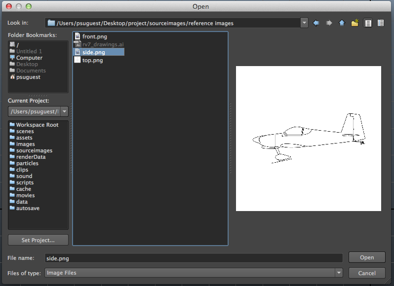
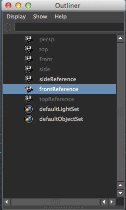

#Creating Modeling Reference Planes in Maya

Reference planes are used as modeling guides. Typically, there are three orthographic views which describe the top, side, and front features of an object. The beginning stages of polygonal modeling is much like gesture drawing. Start as simple as possible, and increase detail when you need to describe a shape.

##Downloading the project

1) Navigate [here](https://drive.google.com/open?id=0BzXX6rmROMNWRXpNMHB6dkJoY0E&authuser=0) in a web browser.

2) Click on **File** → **Download **at the top of the file directory.

3) Drag *ex_1_xyz123.zip* to the desktop. Double-click to extract the project folder.

##Creating reference image planes

1) Replace "**xyz123**" to your PSU user ID. 

2) Open Maya. Go to **File** → **Set Project**. Navigate to and highlight the **ex_1_[user id]** (the one you just renamed) folder on the Desktop. Click **Set**.

3) Open the Outliner window by choosing **Window** → **Outliner**.

4) You will see a list of four cameras. Select the "side" camera by clicking on it once.

5) Go to **Edit** → **Duplicate**.

6) A new camera ‘side1’ will be created. Double-click on ‘side1’ to rename it to ‘sideReference.’

7) With sideReference selected, go to the viewport’s menu and select **Panels** → **Look Through Selected**.

8) From the **View** menu in the viewport panel, choose **Image Plane** → **Import Image...**

9) When the Open dialog box appears, navigate to ‘reference images’ folder within ‘sourceimages’ folder. (If you cannot find this folder, follow **Step 2**) Select the *side.png* and click **Open**.

10) In the **Persp** viewport, zoom out to see the image plane. Select imagePlane1 from the outliner and use the translate (move) tool to push the image plane to the other side of the grid. Ensure that the camera stays in it’s original position.

11) In the Outliner window, select ‘front’. Choose **Edit** → **Duplicate**. Rename ‘front1’ to ‘frontReference.’

12) Select ‘top’ in the Outliner window, and choose **Edit** → **Duplicate**. Rename ‘top1’ to ‘topReference.’

**Your Outliner should look like the following:**

13) Select ‘frontReference’ from the Outliner window.

14) In the Viewport window, select **Panels** → **Look Through Selected**.

15) In the Viewport window, select **View** → **Image Plane** → **Import Image...**

16) In the Open dialogue box, choose *front.png* and click **Open**.

17)  In the **Persp** viewport, zoom out to see the image plane. Select imagePlaneShape2 from the Outliner and move behind the grid.

18) Select ‘topReference’ from the Outliner window.

19) In the Viewport window, select **Panels** → **Look Through Selected**.

20) In the Viewport window, select **View** → **Image Plane** → **Import Image...**

21) In the Open dialogue box, choose *top.png* and click **Open**.

22)  In the **Persp** viewport, zoom out to see the image plane. Select imagePlaneShape3 from the Outliner and move behind the grid.

**Prevent accidental translation of image planes**

1) Select ‘sideReference’ from the Outliner.

2) In the Attribute Editor, right-click on the word ‘Translate’ in the ‘Transform Attributes’. Click on "Lock Attribute."

3) Repeat step 2 for **Rotate** and **Scale** in the attribute editor.

4) Repeat this process for the ‘frontReference’ and ‘topReference’ cameras.

5) Go to **File **→ **Save** as **_ex_1_[userid]_**.

To model using these reference planes, use the original ‘top,’ ‘front,’ and ‘side’ cameras. **Do not work within the viewport of an active reference plane camera. ** To switch to another camera view, select **Panels** → **Orthographic** → **front**, **top**, or **side**. To determine what camera you are currently looking through, check the label on the bottom of the viewport. See the image below.

